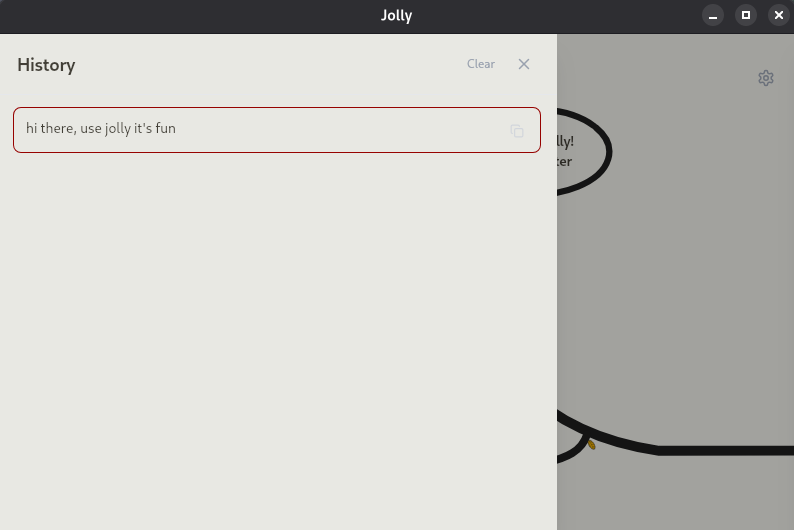
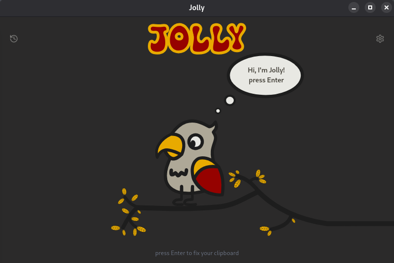
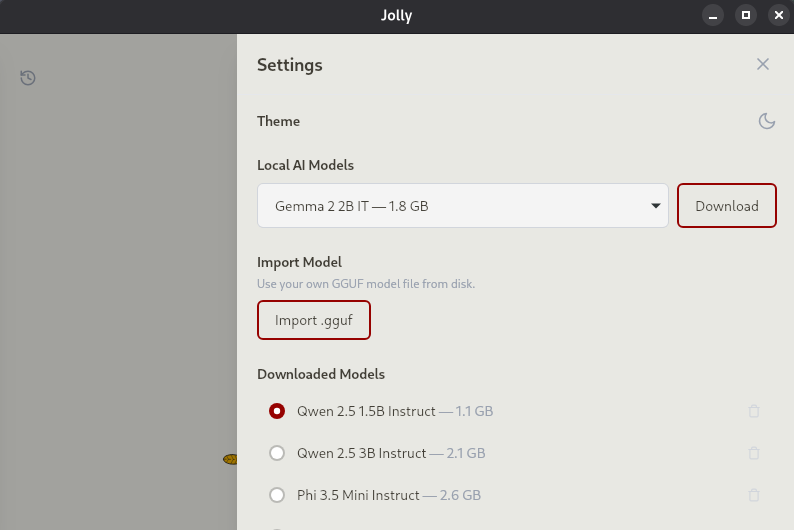

<div align="center">


# Jolly


[](https://github.com/felixscode/jolly/actions/workflows/deploy-web.yml)
[](https://github.com/felixscode/jolly/actions/workflows/release-app.yml)
[](https://github.com/felixscode/jolly)
[](https://github.com/felixscode/jolly/releases)


**Local-first spell checker powered by on-device LLMs.**
Copy Enter Paste! Jolly read from your clipboard and applies changes so you can paste it back.
Nothing leaves your device.


[Features](#features) | [Installation](#installation) | [Benchmarks](#benchmarks) | [Models](#available-models) | [Development](#development) | [Tech Stack](#tech-stack)

</div>

## About

Spell checkers are annoying — squiggly lines and too much clicking. Pasting text into an AI with "fix spelling" works, but sending your mails and notes to LLM providers feels uneasy. Jolly does it locally and makes it fun.

Copy text, hit Enter, paste it back — corrected. Jolly reads your clipboard, passes it through a local LLM, and writes the result back. If your machine doesn't support local inference, you can use API keys or conventional grammar checking via [Harper](https://github.com/Automattic/harper). Everything runs on your device.

Built with SvelteKit, Tailwind, Tauri, and lama.cpp in Rust and TypeScript. Jolly started as a way to learn frontend development and explore the trade-offs between local LLM inference and conventional grammar checkers. On one a "simple" task

## Features

- **Privacy-first**: All inference runs locally — nothing leaves your machine
- **One-shot correction**: Copy, press Enter, paste — corrected text is in your clipboard
- **Multiple ways**: Choose from on-device LLMs, Openrouter via Api Call or Harper 

## Installation

### Pre-built Binaries (Recommended)

Download the latest release for your platform from [GitHub Releases](https://github.com/felixscode/jolly/releases):

| Platform | File | Notes |
|----------|------|-------|
| **macOS** | `Jolly_x.x.x_aarch64.dmg` | Apple Silicon (Intel via Rosetta) |
| **Windows** | `Jolly_x.x.x_x64-setup.exe` | NSIS installer |
| **Linux** | `Jolly_x.x.x_amd64.deb` | Debian/Ubuntu |
| **Linux** | `Jolly_x.x.x_amd64.AppImage` | Universal |

### Building from Source

**Prerequisites:**
- [Node.js](https://nodejs.org/) >= 18
- [Rust](https://rustup.rs/) 
- [Tauri CLI](https://v2.tauri.app/start/prerequisites/) system dependencies

```sh
git clone https://github.com/felixscode/jolly.git
cd jolly
npm install
npx tauri build
```

#### GPU Acceleration

Thanks to amazing lamacpp and vulcan Jolly detects GPU availability at runtime. If initialization fails, it silently falls back to CPU. It uses vulcan for win,linux and metal for mac.

## Available Models

The [GRMR](https://huggingface.co/qingy2024/GRMR-V3-G4B-GGUF) models are specifically fine-tuned for grammar correction — they take text in and return corrected text with minimal over-editing. The other models (Qwen, Mistral) are general-purpose instruction-following LLMs prompted to fix spelling and grammar.

| Model | Size | Quantization |
|-------|------|--------------|
| GRMR 2B Instruct | 1.7 GB | Q4_K_M |
| GRMR V3 G4B | 1.7 GB | Q2_K |
| GRMR V3 G4B | 2.5 GB | Q4_K_M |
| GRMR V3 G4B | 4.1 GB | Q8_0 |
| Qwen3 1.7B | 1.3 GB | Q4_K_M |
| Qwen3.5 4B | 2.9 GB | Q4_K_M |
| Mistral 7B Instruct v0.3 | 4.7 GB | Q4_K_M |

## Benchmarks

Tested across 8 cases (short, medium, email) in English and German.
Inference on CPU — times will be significantly faster with a gpu.

| Model | Params | Size | Accuracy | Similarity | Avg Latency |
|-------|--------|------|----------|------------|-------------|
| **Qwen 2.5 3B** | 3B | 2.0 GB | **72%** | **99%** | 7.2s |
| Qwen 2.5 1.5B | 1.5B | 1.0 GB | 58% | 79% | 4.6s |


> Run benchmarks yourself: `cargo run --bin benchmark` from `src-tauri/`.

Models are downloaded on demand from Hugging Face and cached locally.

[!TIP] you can add any gguf model via the settings in app.  


## Acknowledgements

- [Tauri](https://github.com/tauri-apps/tauri) — desktop app framework
- [Rust](https://www.rust-lang.org/) — systems programming language
- [Svelte](https://github.com/sveltejs/svelte) — reactive UI framework
- [llama.cpp](https://github.com/ggerganov/llama.cpp) — local LLM inference engine
- [Harper](https://github.com/Automattic/harper) — grammar checker
- [GRMR](https://huggingface.co/qingy2024) - grammer finetuned models

## Screenshots

<div align="center">



</div>

## License

[GPL-3.0](LICENSE) — free and open source. No account, no subscription.
